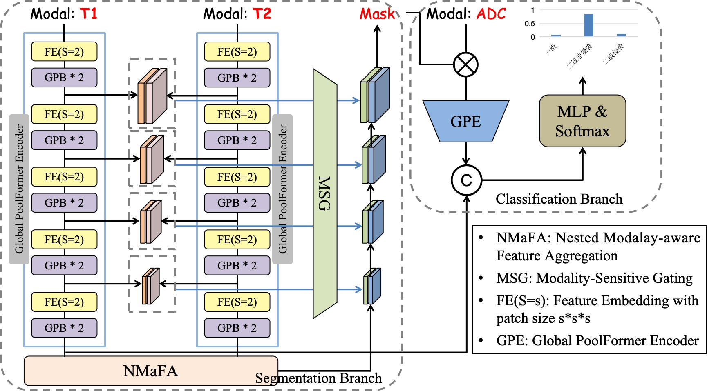

# NestedFormer++

This repo was codebase for Multi-Task Nestedformer (Nestedformer++). The structure supports multimodal inputs (MRI images) and segmentation & classification at the same time. Code will be completed soon.



## Getting Started

### Setup
```commandline
pip install monai
pip install tqdm
pip install tensorboardX
```

### Download data
Please download the brats2020 datasets. Of course, switching to other datasets is ok.

### Run 
``` commandline
python main.py --distributed  --logdir=log_train_nestedformer --fold=0 --json_list=./brats2020_datajson.json --max_epochs=1000 --lrschedule=warmup_cosine --val_every=10 --data_dir=/data/MICCAI_BraTS2020_TrainingData/  --out_channels=3 --batch_size=1 --infer_overlap=0.5
```
--data_dir is the location of the data.

## Train your own dataset
The data processing code is in utils/data_utils.py. You can modify this code for your own dataset.


## Acknowledgment
Our implementation is mainly based on the [Nestedformer](https://github.com/920232796/NestedFormer) (MICCAI 2022)
